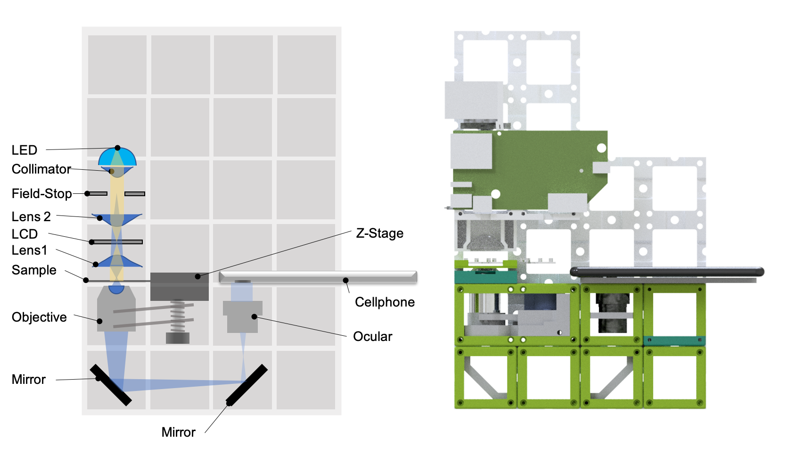
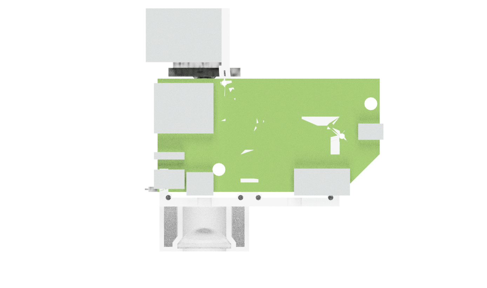
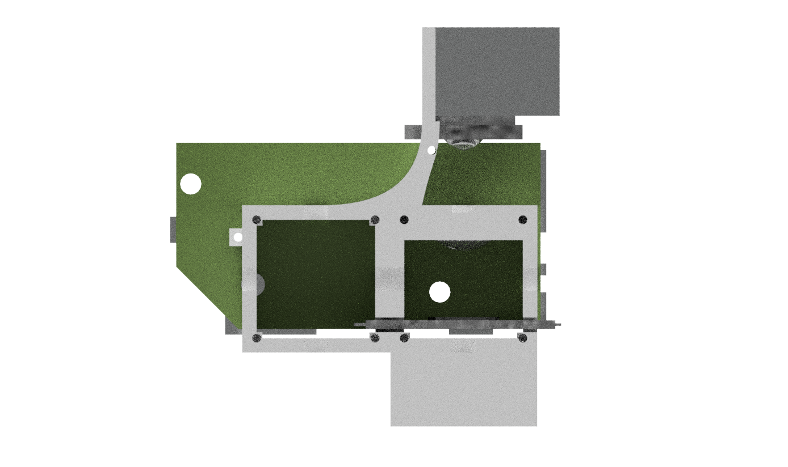
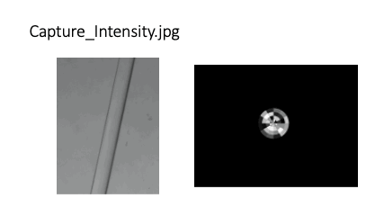

# openUC2 openKOEHLER
---

This is the repository for the openKOEHLER project which integrates an adaptive diaphragm (e.g. variable effective light-source plane) in [Koehler configuration](https://en.wikipedia.org/wiki/K%C3%B6hler_illumination) into the UC2-system.

***Fig 1:*** *This is the ready-to-print module which clicks into the UC2-system*

This module is based on the work "*Using machine-learning to optimize phase contrast in a low-cost cellphone microscope*" which can be found in [PLoS One](https://journals.plos.org/plosone/article/authors?id=10.1371/journal.pone.0192937). The idea is to generate phase-contrast images by varying the effective light-source shape in the pupil plane of the condenser. Therefore we place an LCD in Koehler configuration which is conjugate to the back focal plane (BFP) of the microscope objective lens. We rely on a low-cost LED HDMI projector which can be optained from Ebay.

The module holds all optical components in place:

***Fig 2:*** *The PCB drives the high-power LED and the LCD. A HDMI connection to an external computer controls the pixels of the adaptive light source.*

***Fig 3:*** *Backside of the module which hosts all components in place.*

The angle between the collimated and expanded Laser-beam and the DMD is 25° in order to get the maximum in the diffracted orders.

***Features:***
- Variable light-source in Koehler configuration (conjugate to BFP)
- Very low cost:  ~100€
- Easy to align
- Open-Source

# Table of Content
* **[Software](#-software)**
* **[Hardware](#-hardware)**
* **[Bill of materials](#-bill-of-materials)**
* **[Electronics](#-electronics)**
* **[Results](#-results)**

# Software
Displaying patterns can conviently be done with a power-point presentation. More python-based software will follow soon.

# Hardware

Below we describe how the device can be build and assembled in order to replicate the whole system as shown in the rendering above. One needs additional parts that can be found in the core [openUC2 repository](https://github.com/bionanoimaging/UC2-GIT).

## Bill of material

Below you will find all components necessary to build this device

### 3D printing files

All these files need to be printed. We used a Prusa i3 MK3 using PLA Prusament (Galaxy Black) at layer height x.x mm and infill xx%.

Parts to print:

* 1× [Koehler-Module](./STL/Assembly_HDMI_Projector_30_Cube_Projector_frame_10)

### Additional parts
This is used in the current version of the setup

|  Type | Details  |  Price | Link  |
|---|---|---|---|
| Aspherical Lenses |  Thorlabs ACL3026U, f'=60mm |  32 € | [Thorlabs](https://www.thorlabs.com/thorproduct.cfm?partnumber=ACL3026U-A)  |
| HDMI LED Projector |  A30 MINI LED Laser Projektor Beamer Cinema Heimkino HD 1080p USB SD AV HDMI VGA |  55 € | [Ebay](https://www.ebay.de/itm/A30-MINI-LED-Laser-Projektor-Beamer-Cinema-Heimkino-HD-1080p-USB-SD-AV-HDMI-VGA/283179326469?epid=21010262499&hash=item41eecd9c05:g:S6IAAOSw-BJfmrYj)  |

### Design files
The original design files are in the [INVENTOR](./INVENTOR) folder. *FOR ANOTHER FORMAT, GET YOUR OWN FOLDER.*

### Electronics
*THE FANCY ELECTRONICS TO RUN THE MOTOR! ...OR WHATEVER YOU USE THERE.*

### Assembly of the DEVICE
Please have a look [here](./DOCS/Beamerscope_Instructions) (borrowed from the beamerscope).

## Showcase
This is just some stack where we measured intensity while variyng the illumination source shape:

## Get Involved

This project is open so that anyone can get involved. You don't even have to learn CAD designing or programming. Find ways you can contribute in  [CONTRIBUTING](https://github.com/openUC2/UC2-GIT/blob/master/CONTRIBUTING.md)

## License and Collaboration

This project is open-source and is released under the CERN open hardware license. Our aim is to make the kits commercially available.
We encourage everyone who is using our Toolbox to share their results and ideas, so that the Toolbox keeps improving. It should serve as a easy-to-use and easy-to-access general purpose building block solution for the area of STEAM education. All the design files are generally for free, but we would like to hear from you how is it going.

You're free to fork the project and enhance it. If you have any suggestions to improve it or add any additional functions make a pull-request or file an issue.

Please find the type of licenses [here](https://github.com/openUC2/UC2-GIT/blob/master/License.md)

REMARK: All files have been designed using Autodesk Inventor 2019 (EDUCATION)

## Collaborating
If you find this project useful, please like this repository, follow us on Twitter and cite the webpage! :-)
